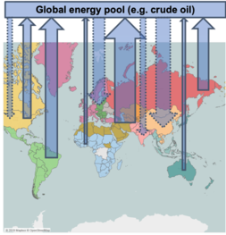
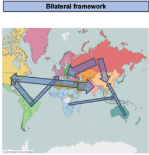
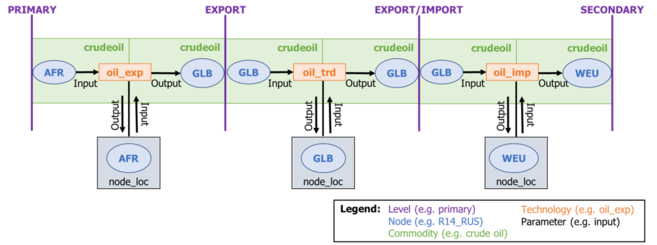
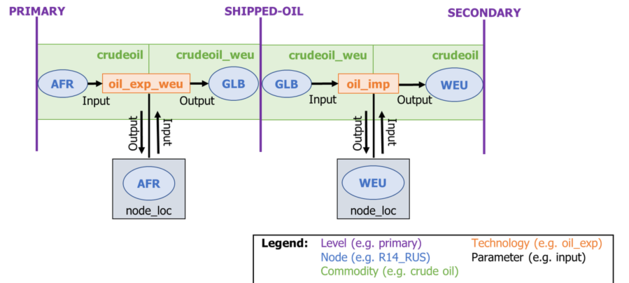

# MESSAGE-TRADE

MESSAGE-TRADE is an extension on the MESSAGEix global energy model. MESSAGE-TRADE allows users to model international trade in fuels bilaterally, instead of as a global pool.

## Background
Text is sourced from Shepard, Jun. "Representing Shipping and Transport Networks in Global Energy Models", International Institute for Applied Systems Analysis (2019).

[MESSAGEix](https://github.com/iiasa/message_ix) currently represents the world through [14 regions](http://www.iiasa.ac.at/web/home/research/researchPrograms/Energy/MESSAGE-model-regions.en.html). Trade is represented through a global pool framework. In this framework, regions with excess energy resources can export to a global pool from which regions that demand that resource can import. Figure 1(a) below illustrates the global pool schema as a map, while Figure 2(a) represents the schema as a flow of energy. 

|*Figure 1(a) Map of Global Pool Schema*|*Figure 1(b) Map of Bilateral Trade Schema*|
|:--:|:--:| 
|||

|*Figure 2(a) Flow of Global Pool Schema*|
|:--:|
||

|*Figure 2(b) Flow of Bilateral Trade Schema*|
|:--:|
||

Here, commodities represent the energy resource (e.g. LNG) while the technology represents the movement of the commodity (e.g. LNG exports, LNG imports). The technology is differentiated by commodity but not by location. This is what defines the global pool schema.

Note that while the global pool schema allows us to examine the total exports from/imports to regions, it does not explicitly model the trade flows among them. This explicit bilateral representation is necessary to model trade as a network and to measure security indices like trade portfolio diversity and import dependence.

The bilateral trade representation is illustrated in Figure 1(b) and 2(b). 

In order to explicitly delineate bilateral trade flows among regions, we needed to completely reparametrize trade in MESSAGEIX. Note that in the global pool schema, the origin of fuel imports and the destination of fuel exports are not explicit in the commodity or technology. In the bilateral framework we explicitly define the destination of commodity imports (e.g. LNG_weu means LNG imports to Western Europe) and export technologies (e.g. LNG_exp_weu means LNG exports from the given region that are destined for Western Europe). This is illustrated in Figure 2(b). 

## Directory structure
### [/derived](https://github.com/junukitashepard/message_trade/tree/master/derived)
#### [**/1_trade:**](https://github.com/junukitashepard/message_trade/tree/master/derived/1_trade)
Imports net calorific data (IEA) (0). Imports bilateral trade data (BACI) and energy balances (IEA) (1-2). Converts weight in BACI data to physical units (TJ) (1). Validates BACI data across IEA. Dashboards can be found in /dashboards/iea_trade_validation.twb (3).
#### [**/2_nodes:**](https://github.com/junukitashepard/message_trade/tree/master/derived/2_nodes) 
Sets major sea and inland water ports (1-3). creates uniform nodes based on user-defined degrees of separation (2). Runs Floyd-Warshall Algorithm (4-5). Collapses to one shortest route by country pair (7). Aggregates to MESSAGE regions (8).
#### [**/3_build_matrices:**](https://github.com/junukitashepard/message_trade/tree/master/derived/3_build_matrices) 
(Note: not used for analysis) Build matrices of direct and embedded armed conflicts (1) and trade sanctions (2).

### [/analysis](https://github.com/junukitashepard/message_trade/tree/master/analysis)
#### [**/1_toy_scenario:**](https://github.com/junukitashepard/message_trade/tree/master/analysis/1_toy_scenario) 
For testing only, not used for analysis.
#### [**/2_regressions:**](https://github.com/junukitashepard/message_trade/tree/master/analysis/2_regressions)
Prepare data (1) and add gravity function variables (2). Run summary statistics (3). Function for gravity-based OLS, used for proceeding scripts (4). LASSO test (4_variable_selection). Compile regression results in Excel workbooks (5). Compile regression results in dataframe, to be used for parameter compilation (6). Add tariff parameters (lo and hi) (7).
#### [**/3_msg_parameters:**](https://github.com/junukitashepard/message_trade/tree/master/analysis/3_msg_parameters) 
All parameters for bilateral schema are compiled in scripts in this directory. User can run [run_all.R](https://github.com/junukitashepard/message_trade/tree/master/analysis/3_msg_parameters/run_all.R) to compile all parameters. Individual parameterizations can be found in corresponding files. 
#### [**/4_run_message:**](https://github.com/junukitashepard/message_trade/tree/master/analysis/4_run_message) 
Contains scenario definitions (scenarios.xlsx), and compilation of GDX files written in Python (compile_scenario.py). User can run [compile_scenario.py](https://github.com/junukitashepard/message_trade/tree/master/analysis/4_run_message/compile_scenario.py) to compile all scenario GDX files. Initial post-processing (optional) can be done in [map_tradeflows.R](https://github.com/junukitashepard/message_trade/tree/master/analysis/4_run_message/map_tradeflows.R) and [region_coordinates.R](https://github.com/junukitashepard/message_trade/tree/master/analysis/4_run_message/region_coordinates.R)
#### [**/5_post_process:**](https://github.com/junukitashepard/message_trade/tree/master/analysis/5_post_process) 
Contains all plotting scripts.

## Contributing
Pull requests are welcome. For major changes, please open an issue first to discuss what you would like to change.

## License
TBD